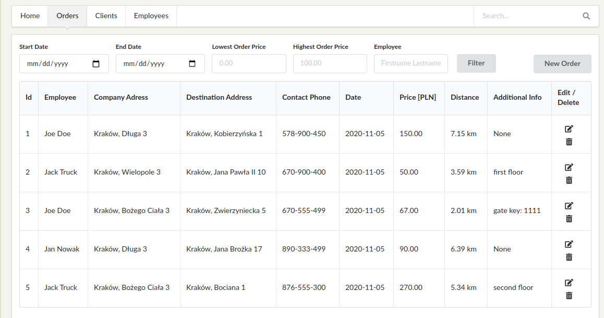
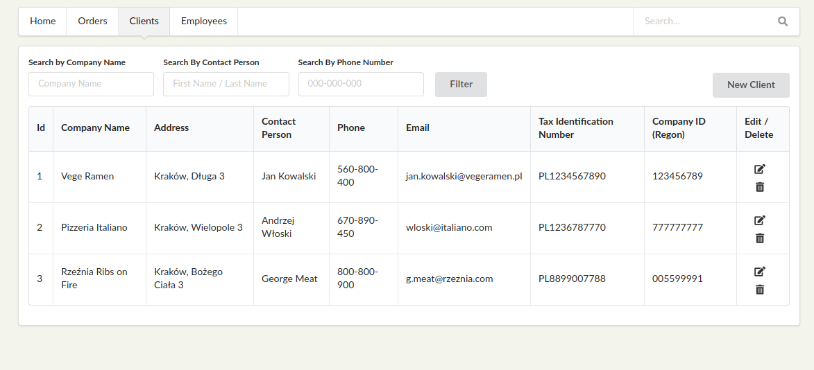
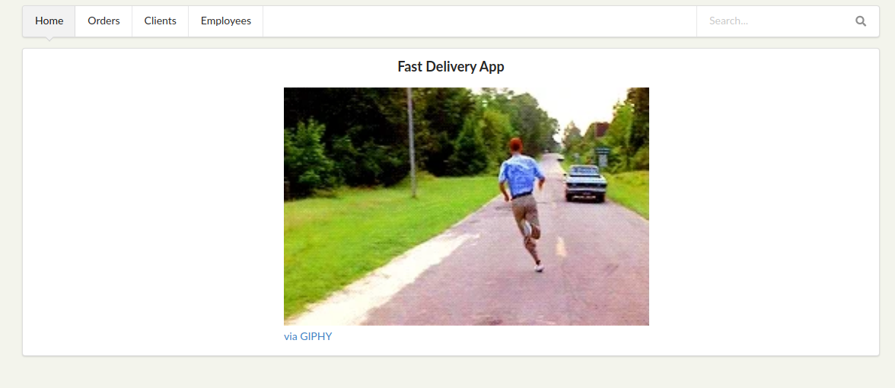

#### Simple API for food delivery company:

1. Delivery registration by the supplier
2. Get monthly, weekly delivery reports
3. Manage Database of products

:snake: FAST_API :snake:, SQLAlchemy

    - FrontEnd      -> Semantic UI
    - Unit tests    -> Pytest 
    - Testing API   -> Postman / Insomnia
    - DB            -> SQLite

to run app:
    
    $ git clone <repo> .
    $ virtualenv venv
    $ source venv/bin/activate
    $ pip install -r requirements.txt
    $ python run.py
    
App use external API (https://developer.mapquest.com/) to calculate distance between Client address and customer:
Set your API_KEY for proper data loading:

    $ export API_KEY=<your API KEY>
    
After this load data:

    $ python load_db.py
    
- http://127.0.0.1:8000/fast_delivery
    
Some screens:

   
    
    
    
    
    

